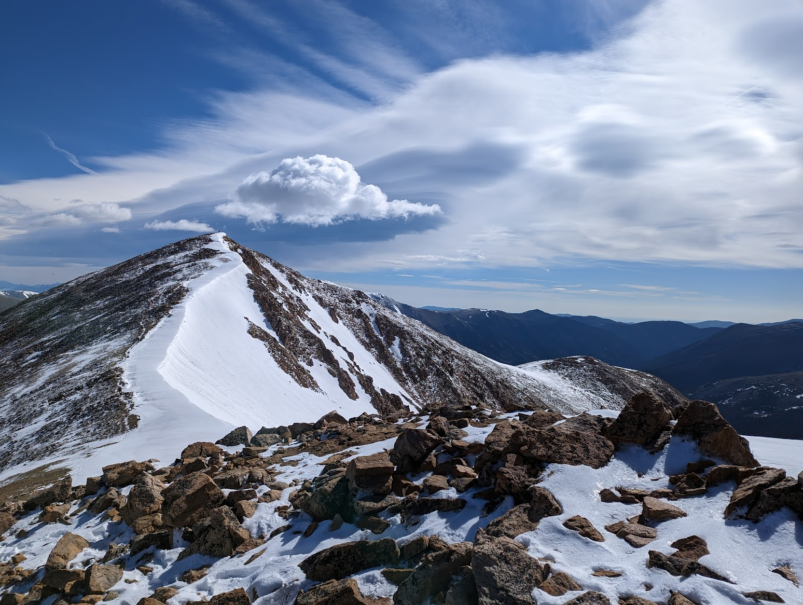

## Hi, I'm Alex 🏔️

I'm a software engineer living near Denver, Colorado, USA. I love open source software, learning new concepts, building neat projects, and tackling
steep trails.

I've worked on MRI data analysis for novel preclinical studies, web apps that delivered solutions to enterprise-level customers,
and a lot of other cool integrations and functionality.

I keep most of the code I share on [a GitLab group](https://gitlab.com/alexlab-cloud) where I can organize things with
a bit more control.

### Links

---

