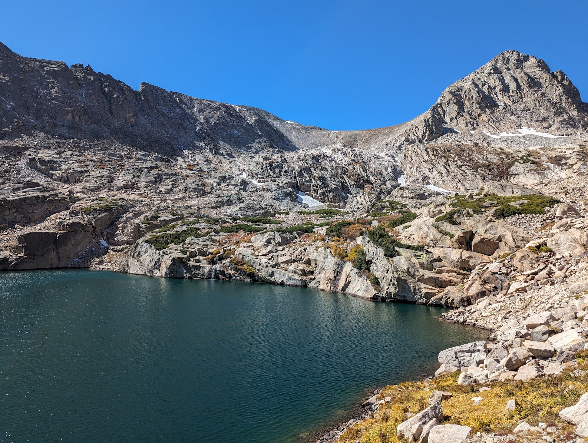

# Hi, I'm Alex

I am a software and data engineer living in Colorado, USA.

I use GitHub for collaboration and browsing great open source work from the community.

## Projects

I mainly track my source code on [Codeberg][href.codeberg]:

  
  &nbsp;
  

## Websites

- <a href="https://acochran.dev" title="My personal website">acochran.dev</a>
- <a href="https://c-forge.cc" title="My engineering collective">c-forge.cc</a>

---

  
  &nbsp;
  
  &nbsp;
  
  &nbsp;
  

---

---

  
  

<!-- Links -->
<!-- ----- -->
[href.codeberg]: https://codeberg.org
[href.alex.homepage]: https://acochran.dev
[href.alex.public-email]: mailto:contact@acochran.dev

<!-- Badge URLs -->
<!-- ---------- -->
[badges.personal-website]: https://img.shields.io/badge/acochran.dev-blue?style=for-the-badge&color=%23470ff4
